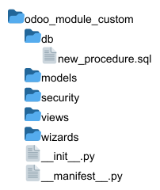

+++
title = 'Cara Menyimpan Query SQL Pada Modul Odoo'
date = 2024-11-26T18:41:16+07:00
draft = false
tags = ['odoo']
categories = ['Web Dev']
+++

Masalahnya, praktik meletakkan query procedure PostgreSQL langsung di database lalu memanggilnya dengan function `execute`
di kode python merupakan hal yang buruk ketika procedure tersebut dikerjakan oleh beberapa orang.

Sayangnya, ketika banyak orang mengerjakan query procedure langsung di database, bisa mengakibatkan inkonsistensi kode.

Untuk itu, diperlukan suatu cara untuk mensinkronkan query sql yang di kerjakan di dalam team.

## Buat Folder db
Pertama, kita buat folder baru didalam modul kustom kita dengan nama `db`. Yang nantinya akan menjadi tempat kita
meletakkan file berformat `.sql`.



## Tambahkan ke manifest.py
File ini selanjutnya kita daftarkan di `manifest.py`.
```python
{
    #data manifest lainnya
'data': [
    'data/ir_cron_data.xml',
    'views/tms_menu.xml',
    'db/new_procedure.sql', #file baru
    'views/my_views.xml',
],
    #data manifest lainnya
}
```

## Contoh Query PostgreSQL
Sebagai contoh, saya membuat query Postgresql di bawah ini. Yang nantinya akan execute pada kode python.
```postgresql
CREATE OR REPLACE FUNCTION float_to_time(hours FLOAT)
        RETURNS TIME AS $$
BEGIN
RETURN MAKE_TIME(
        FLOOR(hours)::INT,  -- hours
        FLOOR((hours - FLOOR(hours)) * 60)::INT,  -- minutes
        ROUND(((hours * 3600)::INT % 60), 0)  -- seconds with casting
       );
END;
    $$ LANGUAGE plpgsql;
```
Jika sudah, kita coba upgrade module tersebut.

---

## Kesimpulan
Dengan cara ini, setiap perubahan procedure sql, akan dilakukan melalui upgrade module kustomisasi kita.
Bukan lagi menaruhnya langsung di procedure database.
Hal ini akan sangat meminimalisir kesalahan ketika bekerja di dalam tim yang banyak.

Terimakasih.