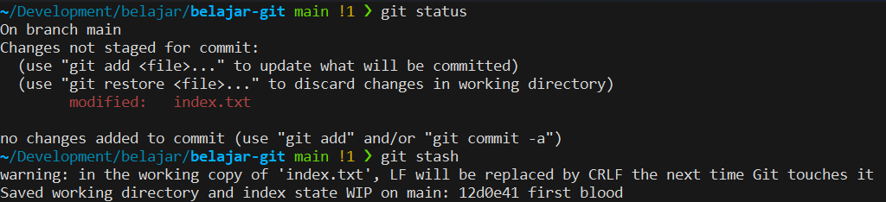
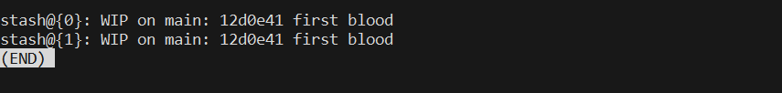
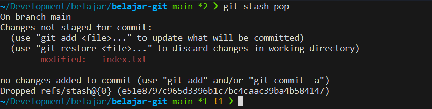
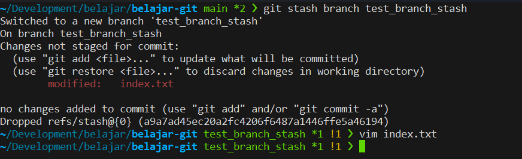

+++
title = 'Git Stash - Part 1'
date = '2025-07-06T18:32:24+07:00'
draft = false
description = ''
categories= ['Web Dev', 'Git']
tags = ['git']
+++
## Latar Belakang
Ketika seorang developer sedang mengerjakan sebuah fitur lalu ditengah-tengah pekerjaan yang belum selesai, 
developer terpaksa atau dipaksa untuk meninggalkan pekerjaan yang belum selesai di branch tersebut, untuk pindah ke branch lain.

Biasanya dikarenakan ada pekerjaan lain yang lebih urgent untuk diselesaikan yang menuntut developer untuk checkout atau pindah dari branch yang sedang di develop.

Pada waktu tersebut, biasanya developer malas atau enggan untuk membuat commit dari pekerjaan yang belum selesai. Namun ingin tetap memisahkan pekerjaan yang belum selesai dengan pekerjaan yang baru.

## Git Stash
Definisi dari official Git.
> Stashing takes the dirty state of your working directory — that is, your modified tracked files and staged changes — and saves it on a stack of unfinished changes that you can reapply at any time (even on a different branch).

Intinya, dengan fitur **Git Stash**, kita akan menyimpan pekerjaan yang belum selesai ke sebuah tempat penyimpanan khusus untuk list pekerjaan yang belum selesai.

## Contoh Command

### Membuat Stash
Untuk membuat Stash, gunakan command `git stash`.

### Menampilkan Stash
Ketika ingin menampilkan list dari stash yang telah kita buat, gunakan command `git stash list`.

### Mengeluarkan Stash Dari Index
Untuk mengeluarkan stash dari index, gunakan command `git stash pop`. Namun **perlu diingat**, menggunakan command ini akan otomatis hanya mengeluarkan stash terakhir yang kita buat.

### Membuat Branch Dari Stash
Kita juga bisa membuat branch baru dari stash menggunakan command `git stash branch <nama_branch>`. Namun, menggunakan command ini juga otomatis membuat branch baru dari stash terakhir yang kita buat.

## Kesimpulan
Waktu Penggunaan: ketika sedang ditengah pekerjaan yang belum selesai lalu ingin pindah ke pekerjaan atau branch lain.

Tips : Jangan terlalu banyak membuat stash! Tidak mengerjakan fitur baru lebih baik daripada mengerjakan banyak fitur yang tidak selesai ;)

Sekian. Terimakasih!

---

## References: 
- [Official Git - Git Stash](https://git-scm.com/book/en/v2/Git-Tools-Stashing-and-Cleaning)
