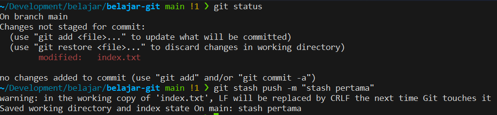
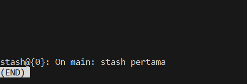
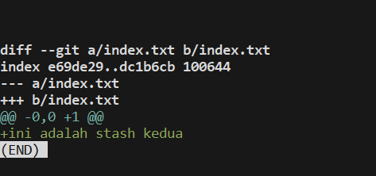
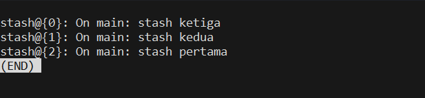
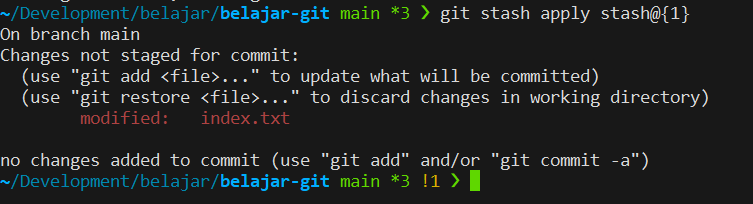
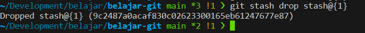
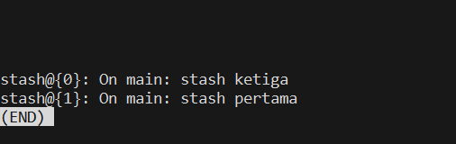
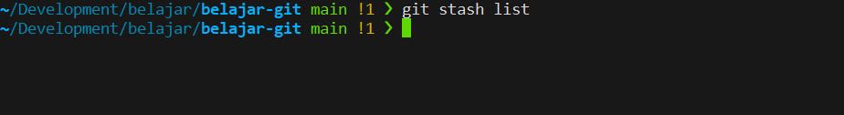

+++
title = 'Git Stash - Part 2'
date = '2025-07-06T20:04:51+07:00'
draft = false
description = 'Sekarang waktunya menggunakan stash seperti seorang pro.'
categories= ['Web Dev', 'Git']
tags = ['git']
+++
## Git Stash Pro Tips
Artikel ini adalah lanjutan dari artikel [Git Stash - Part 1]().

Pada artikel ini, kita akan coba menggunakan Stash seperti seorang pro.

### Menyimpan Stash Dengan Pesan
`git stash push -m "pesan_commit_untuk_stash"` yang nantinya bisa dijadikan referensi task yang belum selesai.

Lalu ketika kita cek list index stash maka akan muncul sebagai berikut,

### Menampilkan Konten Stash
Jikalau kita ingin melihat konten dari stash, kita bisa gunakan command `git stash show -p <index_stash>`.

Atau, jika hanya ingin melihat resume dari file-file yang berubah, bisa gunakan command `git stash show <index_stash>`
### Apply Stash Berdasarkan Index
Misalkan kita punya beberapa index pada stash, lalu ingin mengeluarkan stash dengan index 1, kita bisa gunnakan
command `git stash apply <index_stash>`.

**Note: ** apply stash tidak otomatis menghapusnya dari index stash.

Kita akan keluarkan stash di index kedua.

### Hapus Stash Berdasarkan Index Stash
Jika kita ingin menghapus stash berdasarkan index, kita bisa gunakan command `git stash drop <index_stash>`. 

Sebagai contoh, kita akan menghapus index stash kedua (index stash : stash@{1}).

Hasilnya akan sebagai berikut,

### Hapus Semua Stash
Terakhir, jika kita ingin menghapus semua index stash, kita bisa gunakan command `git stash clear`.

## Kesimpulan
Gunakan git stash dengan bijak. Menggunakan tools kolaborasi seperti git, yang paling penting adalah disiplin dan kominkasi yang jelas ke tim.

---
## References:
- [Official Page - Git Stash](https://git-scm.com/book/en/v2/Git-Tools-Stashing-and-Cleaning)
- [Medium - Git Beyond the Basics: Commands That Make You More Effective](https://medium.com/@charu.sharma517/git-beyond-the-basics-commands-that-make-you-more-effective-e2e245a889db)