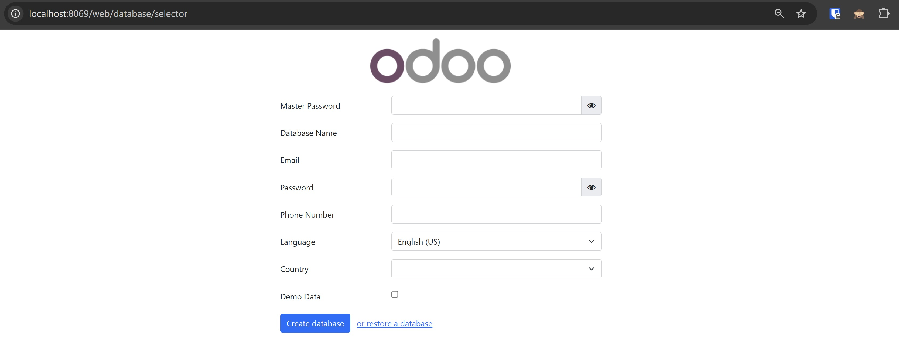

+++
title = 'Install Odoo 17 Menggunakan Docker'
date = 2024-09-29T18:41:16+07:00
draft = false
categories = ['Web Dev']
tags = ['odoo', 'docker']
+++


Tulisan ini akan menunjukkan cara meng-install Odoo dan Postgresql menggunakan Docker.
Sebelum mengikuti tutorial ini, penulis asumsikan bahwa kamu sudah meng-install Docker di sistem operasi kalian.
Jika belum, silahkan ikuti [Tutorial Install Docker]([https://](https://docs.docker.com/engine/install/)) dari laman resminya.

Untuk tuorial kali ini, akan menggunakan source code dari [repository](https://github.com/rohimoz28/odoo-docker)
github saya. Silahkan di fork atau di clone di lokal kalian.

## Struktur Folder

Masuk ke folder yang baru di clone, maka kalian akan menemukan 2 folder. `conf` `customize`. 
Struktur folder kalian akan tampak seperti ini:


### Folder Conf
Folder ini berisikan file - file konfigurasi dari : 
- Docker (`docker-compose.yaml`, `Dockerfile`, `dev.yaml`, `prod.yaml`)
- Database (`pg-data`)
- File Konfigurasi Project (`odoo-demo`)
- Secret File Konfigurasi (`myenvfile.env`)

### Folder Customize
Folder ini berisikan modul kustomisasi odoo. Biasanya, saya membedakan antara modul kustomisasi yang di install dari
thirdparty dengan modul murni hasil kustomisasi kita sendiri.
- `addons-thirdparty` berisikan modul yang berasal dari thirdparty (`OCA`, `Cybrosys`, dll)
- `addons-customize` berisikan modul kustomisasi kita sendiri.

Selanjutnya, saya akan membahas Folder Conf lebih detail.

---

Jika sudah, akan ada beberapa langkah yang kamu harus ikuti sampai Odoo dan Postgresql berhasil terinstall dan
siap kamu gunakan.
1. Buat Struktur Direktori
2. Build Dockerfile untuk Odoo
3. Buat Docker Compose
4. Docker Compose Extension

## Dockerfile
File ini adalah yang akan kita build menjadi docker images yang nantinya digunakan oleh project Odoo kita.
Yang perlu diperhatikan adalah:
- Odoo Version yang ingin digunakan
- Package linux yang ingin di install
- Package dependensi python yang ingin digunakan

Pada repo di atas, saya menggunakan konfigurasi Dockerfile seperti dibawah ini:
```Docker
FROM odoo:17.0
USER root
RUN apt-get -y update && apt-get install -y git xmlsec1 vim zip
RUN pip3 install --upgrade --no-cache-dir pip
RUN pip3 install --no-cache-dir astor
RUN pip3 install --no-cache-dir cachetools
RUN pip3 install --no-cache-dir openupgradelib
RUN pip3 install --no-cache-dir wheel
RUN pip3 install --no-cache-dir pandas
RUN pip3 install --no-cache-dir mdb-parser
RUN pip3 install --no-cache-dir holidays
RUN pip3 install --no-cache-dir bigjson
RUN pip3 install --no-cache-dir pymysql
RUN pip3 install --no-cache-dir formats
RUN pip3 install --no-cache-dir py3o.formats
RUN pip3 install --no-cache-dir py3o.template
# Password security
RUN pip3 install --no-cache-dir zxcvbn
```

Untuk build image dari dockerfile, gunakan command berikut: \
`docker build -t custom-odoo:17.0 .`

## Docker Compose
Untuk konfigurasi `docker-compose.yaml` saya menggunakan seperti ini:
```Docker
version: "3.8"
services:
  odoo-demo:
    image: custom-odoo:17.0
    container_name: odoo-demo
    env_file: myenvfile.env
    depends_on:
      - postgres-demo
    volumes:
      - odoo1-data-demo:/var/lib/odoo
      - ./config/odoo/demo:/etc/odoo
      - ../../customize/odoo-demo/addons-customize:/mnt/addons-customize
      - ../../customize/odoo-demo/addons-thirdparty:/mnt/addons-thirdparty
    networks:
      - demo_odoo_network

  postgres-demo:
    image: postgres:15
    container_name: postgres-demo
    env_file: myenvfile.env
    volumes:
      - ./pg-data:/var/lib/pgsql/data/pgdata
      - ./config/postgresql/postgresql.conf:/etc/postgresql/postgresql.conf:ro
    networks:
      - demo_odoo_network

  # nginx-default:
  #   image: nginx:1.24.0
  #   container_name: nginx-default
  #   volumes:
  #     - ./config/nginx/nginx.conf:/etc/nginx/nginx.conf
  #   depends_on:
  #     - odoo17-default
  #   networks:
  #     - default_odoo_network

volumes:
  odoo1-data-demo:

networks:
  demo_odoo_network:
    name: demo_odoo_network
    driver: bridge
```

## Docker Compose Extension
Docker Compose Extension digunakan supaya `docker-compose.yaml` lebih efision dan memudahkan dalam hal maintenis.
Biasanya, saya menggunakan dua ekstensi. `dev.yaml` dan `prod.yaml`. 

### File extension dev.yaml
```Docker
version: "3.8"
services:
  odoo-demo:
    restart: unless-stopped
    ports:
      - "8069:8069"

  postgres-demo:
    ports:
      - "5433:5432"
    restart: unless-stopped

  # nginx-demo:
  #   restart: no
  #   ports:
  #     - "81:80"
```

### File extension prod.yaml
```Docker
version: "3.8"
services:
  odoo-demo:
    restart: unless-stopped
    ports:
      - "8069:8069"

  postgres-demo:
    ports:
      - "5434:5432"
    restart: unless-stopped

  # nginx-demo:
  #   restart: always
  #   ports:
  #     - "81:80"
```

## Database
Untuk database, saya menggunakan fitur docker bind mounts dimana ini memungkinkan untuk menyimpan file konfigurasi
postgresql dan database nya disimpan di lokal folder, bukan di dalam volume.

Folder `pg-data` berisikan file konfigurasi dan database dari postgresql.

## File Environment
Untuk environment konfigurasi, saya biasa memisahkan konfigurasi environment setiap aplikasi docker ke dalam sebuah file bernama
`myenvfile.env`.

Saya menyimpan user dan password postgresql ke dalam `myenvfile.env` seperti dibawah ini:
```dotenv
# postgresql env variables
POSTGRES_DB=postgres
POSTGRES_USER=odoodemo
POSTGRES_PASSWORD=odoodemo123
PGDATA=/var/lib/pgsql/data/pgdata

# odoo env variables
#HOST=postgres-demo
#USER=odoodemo
#PASSWORD=odoodemo123
```

Alasan saya memisahkannya dari `docker-compose.yaml` adalah untuk modularisasi dan juga kebutuhan setiap user akan
environment aplikasi biasanya berbeda-beda. Hal ini akan membuat `docker-compose.yaml` menjadi lebih general dalam
penggunaannya.

## File Konfigurasi Project
Biasanya juga, saya membuat sebuah folder yang berisikan file konfigurasi dari sebuah project secara khusus. Misalkan,
saya membuat folder `odoo-demo` yang berisi file konfigurasi odoo secara spesifik hanya untuk project tertentu.

Di dalam `odoo-demo` biasanya saya membuat folder:
- odoo : berisi file `odoo.conf`
- postgresql : berisi file `postgresql.conf`
- dan lainnya sesuai dengan kebutuh dari project tersebut

Selanjutnya, kita akan coba menjalankan Odoo menggunakan Docker.

## Coba Jalankan Docker Compose

**Masuk ke dalam folder docker compose**\
`cd /conf/odoo-demo`

**Jalankan docker compose**\
`docker compose -f docker-compose.yaml -f dev.yaml up -d`

**Cek status docker compose**\
Jika tidak ada masalah, jalan kan command di bawah ini untuk cek apakah servis Odoo dan Postgresql sudah berjalan.
`docker ps -l`


**Cara Cek Log Semua Service Docker Compose**\
Biasanya kita akan memerlukan pengecekan log saat servis docker sedang berjalan.
Untuk cek log dari semua servis yang berada di docker compose sebanyak 200 message log terakhir, 
jalankan command:\
`docker compose logs -f --tail 200`

**Cek log per container**\
`docker container logs -f --tail 200 <idContainer>`

### Testing
Sekarang saatnya untuk menjalankan service docker di browser. Jika tidak ada masalah, seharusnya kita bisa mengakses aplikasi odoo pada alamat `http://localhost:8069/`.


---

## Command Docker lainnya

**Restart docker compose**\
`docker compose -f docker-compose -f dev.yaml restart`

**Stop docker compose**\
`docker compose -f docker-compose -f dev.yaml stop`

**Start docker compose**\
`docker compose -f docker-compose -f dev.yaml start`

**Restart docker container**\
`docker container <idContainer> restart`

---

## Penutup
Selamat, sekarang kalian sudah bisa meng-install Odoo dan Postgresql menggunakan docker. 
Dengan konfigurasi dasar ini, selanjutnya kalian bisa install multi instance odoo yang kelak akan di bahas di artikel
lainnya.

Terimakasih.