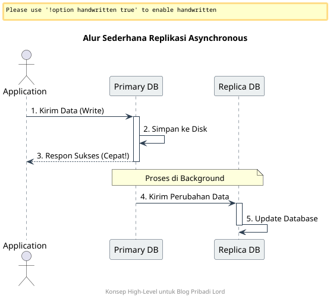

+++
title = 'Postgresql Async Replication Concept'
date = '2026-03-24T13:43:16+07:00'
draft = false
description = ''
categories= ['Database']
tags = ['database', 'postgresql']
+++

Replikasi database adalah salah satu pilar utama dalam membangun sistem yang memiliki ketersediaan tinggi (*High Availability*). Artikel ini akan membahas secara konseptual bagaimana **Streaming Replication** dengan mode **Asynchronous** bekerja, terutama dalam lingkungan yang menggunakan Docker.

---

## 1. Arsitektur Replikasi Asynchronous

Dalam model asynchronous, kita memprioritaskan performa tulis (*write performance*) pada server utama agar aplikasi tetap responsif.

- **Primary (Master):** Server utama untuk operasi tulis dan baca. Ketika terjadi transaksi, server akan langsung melakukan *commit* sukses tanpa menunggu konfirmasi dari server replika.
- **Standby (Replica):** Server cadangan yang bertindak sebagai *read-only*. Server ini terus-menerus menarik (*pull*) data perubahan dari Primary, namun dengan potensi jeda waktu (*lag*) yang sangat kecil.

### Mengapa Asynchronous?
Mode ini dipilih karena tidak memberikan beban tambahan (*overhead*) pada transaksi di sisi Primary. Jika server replika mengalami gangguan jaringan atau sedang *maintenance*, aplikasi utama tidak akan terganggu. Ini adalah pilihan paling populer untuk skalabilitas *read-heavy*.

---

## 2. Mengenal Komponen Inti (The Tech Stack)

Secara konseptual, sistem ini berjalan di atas infrastruktur modern:
- **Orkestrasi:** Menggunakan containerisasi untuk isolasi proses database agar lebih mudah di-*manage*.
- **Storage:** Memanfaatkan *volume persisten* agar data tetap aman meskipun container di-*restart*.
- **PostgreSQL Core:** Memanfaatkan fitur bawaan untuk manajemen *transaction log*.

---

## 3. Cara Kerja di Balik Layar

Untuk memahami replikasi, kita harus memahami bagaimana data berpindah secara konseptual:

1.  **WAL (Write-Ahead Log):** Setiap perubahan data dicatat dulu ke dalam *log* (WAL). Ini adalah "catatan sejarah" transaksi yang wajib ada sebelum data ditulis secara fisik ke *disk*.
2.  **WAL Sender:** Proses di server Primary yang bertugas mengirimkan potongan *log* ke server mana pun yang terhubung sebagai Replika.
3.  **WAL Receiver:** Proses di server Replika yang bertugas menerima kiriman *log* tersebut.
4.  **LSN (Log Sequence Number):** *Pointer* unik untuk menandai posisi data. Master dan Replika saling mencocokkan LSN untuk memastikan tidak ada data yang terlewat.
5.  **Replay Process:** Replika membaca *log* yang diterima dan menerapkannya ke databasenya sendiri sehingga datanya identik dengan Primary.

---

## 4. Alur Konfigurasi Strategis

Secara garis besar, berikut adalah langkah-langkah untuk melakukan *setup* fitur ini:

1.  **Konfigurasi Primary:** Mengatur `wal_level` ke mode `replica` dan membuka akses jaringan melalui konfigurasi identitas host (`pg_hba`).
2.  **Otentikasi Security:** Membuat *user* khusus dengan *role* `REPLICATION` agar jalur komunikasi data lebih aman.
3.  **Base Backup:** Proses *cloning* data awal dari Primary ke Replika agar keduanya memulai dari titik yang sama.
4.  **Signal Standby:** Memberikan indikasi (file *signal*) pada server Replika agar ia berfungsi sebagai bayangan dan tidak mencoba menjadi server mandiri.

---

## 5. Monitoring & Health Check

Sistem replikasi wajib dimonitor secara berkala melalui *dashboard* atau *query* manual. Beberapa metrik kuncinya:
- **Replication Lag:** Jarak data antara Master dan Replika. Dalam mode asynchronous, *lag* ini harus dijaga sekecil mungkin agar data tetap sinkron.
- **Streaming State:** Memastikan koneksi selalu dalam status `streaming` dan bukan `disconnected`.
- **Sync State:** Memastikan status replika terdeteksi dalam sistem, meskipun tipenya adalah asynchronous.

---

## Kesimpulan

Replikasi asynchronous adalah solusi cerdas untuk menjaga skalabilitas tanpa mengorbankan performa aplikasi. Dengan memahami cara kerja aliran WAL dan proses pengiriman data antar server, kita bisa membangun infrastruktur database yang tangguh di atas teknologi container.
