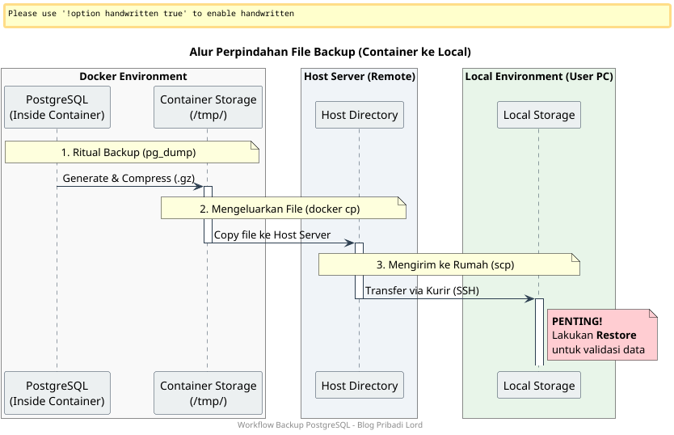

+++
title = 'Strategi Backup Restore Postgresql Docker'
description = ''
date = '2026-03-24T13:30:51+07:00'
draft = false
categories= ['Database']
tags = ['database', 'postgresql', 'docker']
+++

Pernahkah Anda membayangkan terbangun di pagi hari dan mendapati database utama Anda *corrupt* atau data penting sebulan lalu terhapus tanpa sengaja? Di sinilah peran **Daily Backup** menjadi penyelamat nyawa. 

Artikel ini akan membahas cara melakukan backup database PostgreSQL yang berjalan di dalam **Docker Container** secara manual, namun dengan pendekatan yang terstruktur untuk kebutuhan jangka panjang.

---

## Mengapa Kita Butuh Backup Manual?

Meskipun sistem otomatis mungkin sudah berjalan, terkadang kita butuh melakukan backup manual untuk:
1.  **Mitigasi Data Corrupt:** Memiliki salinan segar sebelum melakukan *maintenance* besar.
2.  **Audit Data Masa Lalu:** Mengambil *snapshot* data pada titik waktu tertentu untuk kebutuhan laporan atau investigasi.
3.  **Migrasi Cepat:** Memindahkan data antar server dengan mudah.

---

## Memahami Alur Perpindahan Data

Sebelum masuk ke perintah teknis, mari kita lihat bagaimana data "keluar" dari sistem kita:

1.  **Di Dalam Container:** Kita membuat file backup di lingkungan terisolasi database.
   2.  **Ke Host Server:** Kita menarik file tersebut keluar ke "ruangan" utama server.
      3.  **Ke Local/PC:** Kita mengunduh file tersebut ke komputer kita sebagai salinan fisik terakhir.



---

## Step-by-Step: Mengamankan Data Anda

### 1. Temukan Target (Docker Container)
Langkah pertama adalah memastikan kita tahu di mana database berada. Gunakan perintah:
`docker ps`
Cari nama container Anda (misal: `db-postgres-prod`).

### 2. Ritual Backup (pg_dump)
Kita akan menjalankan perintah "fotokopi" data dari luar container. Perintahnya mungkin terlihat panjang, tapi mari kita bedah:

```bash
docker exec -e PGPASSWORD="password_anda" \
db-container-name bash -c \
'pg_dump -Fc -U user_db "nama_db" > /tmp/backup.dump && gzip -f /tmp/backup.dump'
```

**Bedah Command:**
- `docker exec`: Perintah untuk "menitipkan" tugas ke dalam container.
  - `pg_dump`: Si "Tukang Fotokopi". Ia membaca seluruh database dan mengubahnya jadi file.
  - `-Fc`: Format *custom* (kompresi tinggi dan fleksibel saat restore).
  - `gzip`: Si "Tukang Press". Ia mengecilkan ukuran file agar hemat ruang dan cepat saat dikirim.

### 3. Mengeluarkan File (Docker CP)
Setelah file siap di dalam container (di `/tmp/`), kita harus mengeluarkannya ke server utama:
`docker cp db-container-name:/tmp/backup.dump.gz .`
*Ibarat mengambil paket dari dalam gudang dan meletakkannya di depan pintu.*

### 4. Mengirim ke Rumah (SCP & Networking)
Untuk memindahkan file dari server ke komputer lokal, kita menggunakan **SCP (Secure Copy)**. 

**Analogi Kurir Rahasia:**
Bayangkan SCP sebagai seorang **Kurir Rahasia**. 
- Anda memberi tahu Kurir: *"Ambil paket di alamat IP server ini, di folder ini."*
  - Anda memberikan **Kunci (Password/SSH Key)** agar Kurir bisa masuk.
  - Kurir akan membawa paket tersebut lewat jalur pipa yang aman (SSH) langsung ke meja Anda.

`scp user@192.168.1.100:/home/user/backup.dump.gz ./lokal-folder/`

---

## Aturan Emas: Validasi dengan Restore

Backup tanpa **Restore** hanyalah sekumpulan data mati. Anda wajib melakukan uji coba restore secara berkala.

**Mengapa ini wajib?**
1.  **Validasi File:** Memastikan file backup tidak rusak (*corrupt*).
   2.  **Mitigasi Bencana:** Melatih otot memori Anda agar tidak panik saat terjadi bencana sungguhan. Anda tahu persis berapa lama waktu yang dibutuhkan untuk mengembalikan sistem ke kondisi normal.

---

## Kesimpulan

Backup bukan sekadar tugas tambahan, melainkan investasi ketenangan pikiran. Dengan memahami alur data dari container hingga ke tangan Anda, risiko kehilangan data masa lalu dapat diminimalisir secara signifikan.

Sudahkah Anda mengecek backup Anda hari ini?