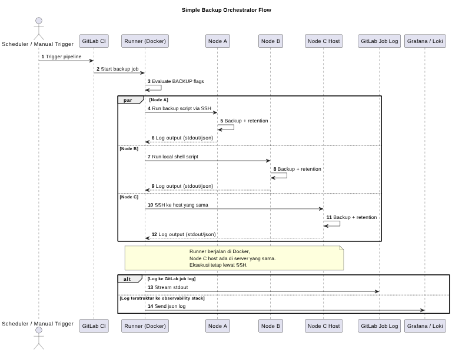

+++
title = 'Membangun Backup Orchestrator Multi-Node dengan GitLab CI'
date = '2026-04-08T16:04:14+07:00'
draft = false
description = 'Pendekatan Hybrid SSH dan Shell Executor'
categories= ['Dev Ops']
tags = ['gitlab', 'cicd', 'devops']
+++

## TL;DR
GitLab CI jadi control plane tunggal untuk backup multi-node dengan workflow terstandar, observable, dan aman.

## Latar Belakang Masalah
Saat jumlah server bertambah, backup sering berubah jadi proses manual yang rapuh:
- Schedule tersebar di banyak host dan sulit diaudit.
- Proses backup antar server tidak konsisten (nama file, retention, logging).
- Kredensial rawan tercecer karena tersimpan lokal di script host.
- Troubleshooting lambat karena log tidak terpusat.

Pada architecture ini, ada 3 node target:
- **Node A**: dengan eksekusi via SSH dari pipeline.
- **Node B**: dengan shell executor lokal host.
- **Node C**: dengan eksekusi SSH dari runner Docker ke host yang sama (runner dan host berada dalam 1 server).

## Kenapa Pendekatan Hybrid Relevan
Pendekatan hybrid dipilih karena realitas infrastruktur tidak selalu homogen. Sebagian host paling aman diakses remote (SSH), sebagian lain lebih efisien dieksekusi langsung dari runner lokal. GitLab CI diposisikan sebagai **single orchestrator** agar kontrol, audit trail, dan observability tetap satu pintu.

## Gambaran Solusi dan Arsitektur
Menurut saya, kekuatan utama design ini ada pada pemisahan jelas antara layer orkestrasi (pipeline) dan layer eksekusi (script per node).

Komponen utama architecture:
1. **GitLab CI Pipeline** sebagai control plane (trigger schedule/manual, rules, artifact).
2. **Backup Script per Node/Project** sebagai execution unit (`database` dan/atau `filestore`).
3. **Runner per Node** untuk menyesuaikan mode eksekusi (remote SSH atau local shell).
4. **CI/CD Variables** sebagai source of truth untuk konfigurasi dan credential.
5. **Log Aggregation ke Artifact** untuk audit dan troubleshooting.

### Pola Eksekusi per Node
- **Node A**: pipeline mengirim script via `ssh ... "bash -s"` lalu menjalankan backup di host target.
- **Node B**: job langsung jalankan shell script karena runner berada di host target.
- **Node C**: job dijalankan dari runner yang di-install menggunakan Docker, lalu konek via SSH ke host yang sama untuk backup PostgreSQL host-level dan kompresi paralel.

### Standardisasi yang Diterapkan
- Validasi variabel wajib sebelum backup dimulai.
- Penamaan file backup berbasis timestamp/date agar traceable.
- Logging ganda: human-readable (`.log`) dan machine-readable (`.json`).
- Retention cleanup otomatis untuk menjaga kapasitas storage.
- Artifact `pipeline_logs/` untuk visibilitas hasil eksekusi.

## Workflow End-to-End
1. Pipeline dipicu oleh **schedule** atau **manual run**.
2. Rules menentukan job mana yang aktif berdasarkan flag environment (`BACKUP_* == true`).
3. Job menjalankan script backup sesuai node:
    - Node A melalui SSH.
    - Node B secara lokal via shell executor.
    - Node C melalui SSH dari runner Docker ke host yang sama.
4. Script melakukan validasi pre-check:
    - env var wajib,
    - container/path/database check,
    - optional anti-duplikasi backup harian (node tertentu).
5. Backup dieksekusi (pg_dump/tar/docker cp), lalu file dipindah ke backup host directory.
6. Log `.log` dan `.json` ditulis ke log directory node.
7. `after_script` mengumpulkan log ke `pipeline_logs/` (scp/cp).
8. GitLab menyimpan artifact untuk inspeksi pasca-eksekusi.
9. Cleanup retention menghapus backup lama sesuai policy.

## Visualisasi Sequence Diagram

## Nilai Praktis dari Pendekatan Ini
1. **Pragmatis untuk infrastruktur heterogen**: tidak memaksa semua node pakai satu model eksekusi.
2. **Operational consistency**: walau mode eksekusi beda, kontrol lifecycle backup tetap seragam dari pipeline.
3. **Security posture lebih baik**: credential disimpan di GitLab Variables, bukan hardcoded di repository.
4. **Observability bawaan**: log terstruktur + artifact mempermudah audit, post-mortem, dan alert integration.
5. **Mudah scale-out**: tambah node baru cukup mengikuti pola folder script + template job + variables.
6. **Dari pengalaman operasional, lebih mudah dikelola**: pendekatan ini terasa lebih ringan untuk management, maintenance, dan monitoring dibanding backup manual tersebar.

## Penutup
Architecture ini menempatkan GitLab CI sebagai pusat orkestrasi backup lintas node dengan design yang seimbang: fleksibel di layer eksekusi, tetapi ketat di layer governance. Hasilnya adalah backup process yang lebih konsisten, lebih mudah diaudit, dan lebih siap untuk scale.
